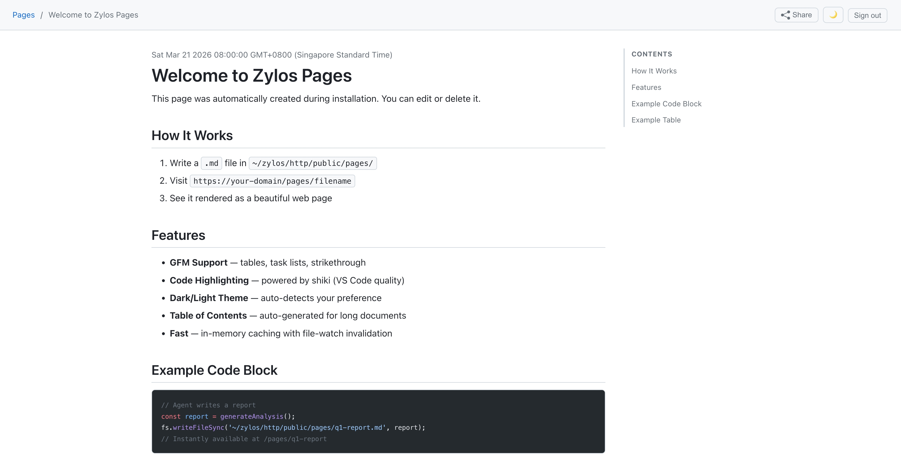

<p align="center">
  
</p>

<h1 align="center">zylos-pages</h1>

<p align="center">
  Registered Markdown, HTML, and downloadable file pages for zylos
</p>

<p align="center">
  <a href="./LICENSE"></a>
  <a href="https://nodejs.org/"></a>
  <a href="https://discord.gg/GS2J39EGff"></a>
  <a href="https://x.com/ZylosAI"></a>
  <a href="https://zylos.ai"></a>
  <a href="https://coco.xyz"></a>
</p>

---

<p align="center">
  
</p>

- **Zero-build publishing** — write a `.md` file, register it, it's a web page
- **Beautiful rendering** — GitHub-style theme with dark/light mode
- **Code highlighting** — VS Code quality syntax highlighting via shiki
- **Fast** — LRU cache + singleflight dedup + file-watch invalidation
- **Navigation sidebar** — slide-out pages list for quick article switching
- **Table of Contents** — independent scrolling TOC for long documents
- **Attachment pages** — register and safely share arbitrary local files without rendering their bytes

## Install

```bash
zylos add pages
```

Or manually:

```bash
cd ~/zylos/.claude/skills
git clone https://github.com/zylos-ai/zylos-pages.git pages
cd pages && npm install
```

## Usage

```bash
PAGES_DIR="$HOME/zylos/.claude/skills/pages"
# Content root = contentDir in ~/zylos/components/pages/config.json
CONTENT_DIR="$(node -p "require(process.env.HOME+'/zylos/components/pages/config.json').contentDir || process.env.HOME+'/zylos/http/public/pages'")"

# 1. Write a page
echo "# Hello World" > "$CONTENT_DIR/hello.md"

# 2. Register it — pages are only served after registration
node "$PAGES_DIR/src/cli/pages.js" register \
  --source "$CONTENT_DIR/hello.md" --uri hello --title "Hello World"

# 3. Visit https://your-domain/pages/p/hello
#    Or browse all pages at https://your-domain/pages/
```

To publish a file as a download page, register it through the same allowed-root
gate. Files other than matching `.md`/`.html` sources become `attachment`
pages; their landing page is `/pages/p/<uri>` and the owner download endpoint
is `/pages/p/<uri>/download`. A share keeps the same `/pages/s/<token>` ledger
and downloads through `/pages/s/<token>/download`.

```bash
node "$PAGES_DIR/src/cli/pages.js" register \
  --source /absolute/resume.pdf --uri resumes/howard --title "Howard's resume"
```

Attachment bytes are never sent through Markdown/HTML rendering, raw/state,
embedded-photo, or logical-asset APIs. Downloads use the extension MIME
allowlist (otherwise `application/octet-stream`), always force
`Content-Disposition: attachment`, and are `no-store`.

### Frontmatter

```yaml
---
title: My Report
description: Q1 competitive analysis
date: 2026-03-21
tags: [research, competitive]
toc: true
---
```

### Verify a page-data migration

The `page_id` schema migration is one-way for older Pages binaries: after it
runs, reverting only the code makes the old binary fail against the re-keyed
database. Take a consistent backup **before** starting the new version. A
SQLite `.backup` includes committed WAL contents; copy attachment storage as
well because attachment directories are also renamed during this migration:

```bash
pages_data_dir=~/zylos/components/pages
pages_backup_dir="$(mktemp -d "${TMPDIR:-/tmp}/zylos-pages-pre-page-id.XXXXXX")"
sqlite3 "$pages_data_dir/pages.db" ".backup '$pages_backup_dir/pages.db'"
cp -a "$pages_data_dir/attachments" "$pages_backup_dir/attachments"
```

Keep that backup until the migration has passed acceptance. Start the new
version so the one-time migration runs, then verify the database and
attachment storage before retiring the migration window:

```bash
PAGES_DATA_DIR=~/zylos/components/pages npm run verify-migration -- --json
```

The command is read-only and exits `0` only when the database schema, page
references, state keys, attachment metadata/files, and migration snapshots all
converge. It exits `1` with machine-readable failures for orphan or duplicate
rows, missing/mismatched/untracked files, legacy URI directories, or residual
snapshot tables. If a state snapshot remains, preserve it as retry evidence;
do not manually drop it. This is a post-migration acceptance check, not a
perpetual naming-convention check or an HTML scan.

If the upgrade must be rolled back, stop Pages first, restore both `pages.db`
and `attachments/` from the pre-migration backup, then revert the code and
start Pages again. **Do not revert the code against the migrated database.**
Confirm the restored old version starts and serves the expected page/state
data before discarding the backup.

## Configuration

Edit `~/zylos/components/pages/config.json`:

```json
{
  "enabled": true,
  "port": 3462,
  "contentDir": "~/zylos/http/public/pages",
  "theme": { "colorScheme": "auto", "codeTheme": "github-dark" },
  "cache": { "enabled": true, "maxEntries": 200, "ttlSeconds": 3600 },
  "security": {
    "allowRawHtml": false,
    "maxFileSizeBytes": 1048576,
    "maxAttachmentSizeBytes": 52428800
  },
  "sharing": {
    "enabled": true,
    "passwordKeyFile": "/secure/pages/share-password-keys.json",
    "passwordRateLimit": { "windowMs": 60000, "tokenMax": 8, "ipMax": 24 }
  },
  "state": {
    "maxKeysPerPage": 50,
    "maxPageBytes": 1048576,
    "shareWriteRateLimit": { "windowMs": 60000, "max": 12, "ipMax": 30 }
  }
}
```

The `state` ceilings and write-rate limits apply only to share-link visitors;
authenticated owner writes are intentionally exempt.

`security.maxFileSizeBytes` remains the render ceiling. The separate
`security.maxAttachmentSizeBytes` ceiling applies to attachment registration
and download (default 50 MiB); install and upgrade hooks add it only when the
key is absent and preserve configured values.

### Optional share passwords

The install and upgrade hooks make custody work out of the box: when no
keyring path is configured, they set `sharing.passwordKeyFile` to a default
outside the Pages data directory
(`~/zylos/vault/credentials/pages/share-password-keys.json`) and create the
versioned 0600 keyring there. To place the keyring yourself, configure
`sharing.passwordKeyFile` (or `PAGES_SHARE_PASSWORD_KEY_FILE`) before
install/upgrade, or at any time run:

```bash
node src/cli/pages.js share-password keyring init
```

If a configured keyring file is missing, the hooks deliberately do not
recreate it — that is the lost-keyring scenario described below and it fails
closed until operator recovery.

Do not copy key bytes into `config.json`. Back up `pages.db` and the keyring as
a consistent pair: the database alone can still verify recipient passwords but
cannot reveal them; the keyring alone contains no passwords. If the keyring is
lost, existing recipients can still unlock from the stored verification hash,
but create/rotate/reveal fail closed until operator recovery. To rotate, take a
fresh pair backup, run `share-password keyring rotate`, verify reveal, and only
then retire an unreferenced old key with `share-password keyring retire <id>`.
The service never silently regenerates a missing or malformed keyring.

Owner lifecycle APIs are CSRF-protected and use explicit operations:

- `POST /api/share` with `protection: {"type":"password","mode":"generated"}`
  or `mode:"provided"` plus a password in the JSON body.
- `POST /api/share/:tokenId/password/enable`, `/reveal`, or `/rotate`.
- `DELETE /api/share/:tokenId/password` to remove protection.

Create/enable/rotate/reveal responses are `no-store`; list responses include
only `protection.type` and retrievability metadata. Agents may read protected
HTML or Markdown with `X-Zylos-Share-Password` on `GET`/`HEAD /s/<token>` or
`/s/<token>.md`. The header never grants attachment or state writes. Never put
passwords in URLs, argv, logs, shared documents, Issues, Task comments, PRs, or
group chats; use stdin for provided CLI passwords and deliver secrets through
the intended private channel only.

## Built by Coco

Zylos is the open-source core of [Coco](https://coco.xyz/) — the AI employee platform.

## License

[MIT](./LICENSE)
